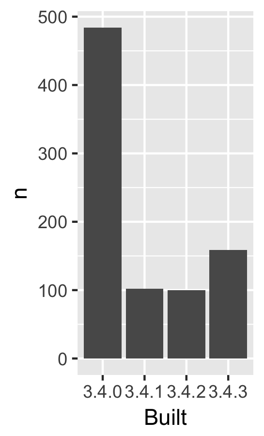

<!-- README.md is generated from README.Rmd. Please edit that file -->
packages-report
===============

Overview
--------

The goal of packages-report is to explore the packages in my R installation.

I have 845 add-on packages installed.

Here's how they break down in terms of which version of R they were built under, which is related to how recently they were updated on CRAN.

| Built |    n|  prop|
|:------|----:|-----:|
| 3.4.0 |  484|  0.57|
| 3.4.1 |  103|  0.12|
| 3.4.2 |  100|  0.12|
| 3.4.3 |  158|  0.19|

### Flow of the analysis

<table>
<colgroup>
<col width="27%" />
<col width="27%" />
<col width="44%" />
</colgroup>
<thead>
<tr class="header">
<th>Input</th>
<th>Script</th>
<th>Output</th>
</tr>
</thead>
<tbody>
<tr class="odd">
<td></td>
<td><a href="R/01_write-installed-packages.R" class="uri">R/01_write-installed-packages.R</a></td>
<td><a href="data/installed-packages.csv" class="uri">data/installed-packages.csv</a></td>
</tr>
<tr class="even">
<td><a href="data/installed-packages.csv" class="uri">data/installed-packages.csv</a></td>
<td><a href="R/02_wrangle-packages.R" class="uri">R/02_wrangle-packages.R</a></td>
<td><a href="data/add-on-packages.csv" class="uri">data/add-on-packages.csv</a> <a href="data/add-on-packages-freqtable.csv" class="uri">data/add-on-packages-freqtable.csv</a></td>
</tr>
<tr class="odd">
<td><a href="data/add-on-packages-freqtable.csv" class="uri">data/add-on-packages-freqtable.csv</a></td>
<td><a href="R/03_barchart-packages-built.R" class="uri">R/03_barchart-packages-built.R</a></td>
<td><a href="figs/built-barchart.png" class="uri">figs/built-barchart.png</a></td>
</tr>
</tbody>
</table>
